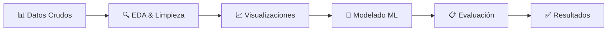

# 🎓 Portafolio de Proyectos de Machine Learning

<div align="center">

**Una colección completa de proyectos de Machine Learning que demuestran diferentes técnicas y aplicaciones del aprendizaje automático**

[](https://www.python.org/)
[](https://jupyter.org/)
[](https://scikit-learn.org/)

</div>

---

## 📖 Sobre este Repositorio

Este repositorio es una colección de **6 proyectos completos de Machine Learning** desarrollados con fines educativos y de demostración profesional. Cada proyecto aborda un problema del mundo real utilizando diferentes técnicas de aprendizaje automático, desde clasificación y regresión hasta clustering, series temporales y procesamiento de lenguaje natural.

### 🎯 Objetivos del Portafolio

- **Demostrar competencias** en diferentes áreas del Machine Learning
- **Mostrar el flujo completo** de un proyecto: desde la exploración de datos hasta el modelo final
- **Aplicar buenas prácticas** de ciencia de datos: código limpio, documentación y reproducibilidad
- **Presentar soluciones** a problemas reales con datos diversos (médicos, marketing, financieros, NLP, etc.)

### 💡 ¿Qué Aprenderás?

Explorando estos proyectos encontrarás:
- ✅ Análisis Exploratorio de Datos (EDA) detallado
- ✅ Técnicas de limpieza y preprocesamiento de datos
- ✅ Visualizaciones profesionales e informativas
- ✅ Implementación de múltiples algoritmos de ML
- ✅ Evaluación y comparación de modelos
- ✅ Interpretación de resultados y conclusiones

---

## 📚 Proyectos Incluidos

### 1. 💬 Análisis de Sentimientos en Redes Sociales
**Carpeta:** `Proyecto_Análisis _Sentimiendos_RRSS/`

**Descripción:** Proyecto de procesamiento de lenguaje natural (NLP) para clasificar automáticamente el sentimiento (positivo, negativo o neutral) de textos provenientes de redes sociales. Implementa técnicas de preprocesamiento de texto, vectorización y modelos de clasificación.

**Notebooks:**
- 📊 `01_EDA_Limpieza_Sentimientos.ipynb` - Exploración del dataset, análisis de distribución de sentimientos, limpieza de texto (tokenización, eliminación de stopwords, normalización)
- 🤖 `02_ML_Entrenamiento_Modelos.ipynb` - Entrenamiento y comparación de modelos de clasificación (Logistic Regression, Naive Bayes, SVM)

**Tecnologías Clave:** Python, Pandas, NLTK, Scikit-learn, TF-IDF, Word Embeddings

**Aplicaciones Reales:** Monitoreo de marca, análisis de opiniones de clientes, detección de tendencias en redes sociales

---

### 2. 🧠 Clasificación de Alzheimer
**Carpeta:** `Proyecto_Clasificación_Alzheimer/`

**Descripción:** Análisis completo de datos médicos para desarrollar modelos predictivos que clasifiquen pacientes según el riesgo o presencia de Alzheimer. El proyecto incluye análisis estadístico exhaustivo, visualizaciones médicas y múltiples modelos de clasificación con evaluación de métricas clínicas.

**Notebooks:**
- 🔍 `01_data_exploratory.ipynb` - Análisis exploratorio profundo de variables clínicas y demográficas
- 📈 `02_data_visualization.ipynb` - Visualizaciones especializadas de correlaciones y patrones médicos
- 📊 `03_data_statistics.ipynb` - Análisis estadístico con pruebas de hipótesis y análisis de significancia
- 🎯 `04_Machine_Learning.ipynb` - Implementación de Random Forest, XGBoost y otros clasificadores con validación cruzada

**Tecnologías Clave:** Python, Pandas, Seaborn, SciPy, Statsmodels, Scikit-learn, XGBoost

**Aplicaciones Reales:** Diagnóstico médico asistido, predicción de riesgo, análisis de factores de riesgo

---

### 3. 👥 Clustering de Marketing
**Carpeta:** `Proyecto_Clustering_Marketing/`

**Descripción:** Proyecto de segmentación de clientes utilizando técnicas de clustering no supervisado para identificar grupos con comportamientos similares. Permite desarrollar estrategias de marketing personalizadas para cada segmento identificado.

**Notebooks:**
- 🧹 `01_data_cleaning.ipynb` - Limpieza de datos de campañas, tratamiento de valores atípicos y missing values
- 📊 `02_data_visualization.ipynb` - Visualización de perfiles de clientes y análisis multivariante
- 🎯 `03_clustering_model.ipynb` - K-Means, DBSCAN, Hierarchical Clustering con evaluación de métricas (Silhouette, Elbow Method)

**Datos Generados:**
- `cluster_profiles.csv` - Perfiles detallados de cada segmento
- `clustering_model_info.json` - Metadata del modelo
- `marketing_campaign_with_clusters.csv` - Dataset original con asignaciones de cluster

**Tecnologías Clave:** Python, Pandas, Scikit-learn, K-Means, PCA, Matplotlib

**Aplicaciones Reales:** Segmentación de mercado, personalización de ofertas, optimización de campañas

---

### 4. 🎬 Sistema Recomendador de Películas (KNN)
**Carpeta:** `Proyecto_Recomendador_peliculas_KNN/`

**Descripción:** Sistema de recomendación de películas basado en similitud utilizando el algoritmo K-Nearest Neighbors. El sistema analiza características de películas y ratings de usuarios para generar recomendaciones personalizadas.

**Notebooks:**
- 🔍 `01_EDA.ipynb` - Análisis exploratorio del dataset de películas, distribución de géneros y ratings
- 📊 `02_Visualizaciones.ipynb` - Visualización de patrones de popularidad y preferencias
- 🤖 `03_Machine_Learning.ipynb` - Implementación del algoritmo KNN, cálculo de similitudes y generación de recomendaciones

**Tecnologías Clave:** Python, Pandas, Scikit-learn, KNN, Scipy, Cosine Similarity

**Aplicaciones Reales:** Sistemas de recomendación en plataformas streaming, e-commerce, content curation

---

### 5. 🏡 Regresión de Precios de Vivienda
**Carpeta:** `Proyecto_Regresión_Precios_vivienda/`

**Descripción:** Proyecto de predicción de precios de viviendas en Estados Unidos utilizando modelos de regresión. Incluye análisis de variables inmobiliarias, feature engineering y comparación de múltiples algoritmos de regresión para optimizar las predicciones.

**Notebooks:**
- 🧹 `01_Data_Cleaning_EDA.ipynb` - Limpieza exhaustiva, detección de outliers, análisis de correlaciones
- 📈 `02_Data_Visualization.ipynb` - Visualización de distribuciones de precios, ubicaciones y características
- 🎯 `03_Machine_Learning.ipynb` - Linear Regression, Ridge, Lasso, Random Forest con optimización de hiperparámetros

**Tecnologías Clave:** Python, Pandas, Scikit-learn, Linear Regression, Regularization, Feature Engineering

**Aplicaciones Reales:** Valoración de propiedades, tasación automática, análisis de mercado inmobiliario

---

### 6. 🌤️ Series Temporales - Predicción de Clima
**Carpeta:** `Proyecto_Series temporales_Clima/`

**Descripción:** Análisis y predicción de variables climáticas utilizando técnicas de series temporales. El proyecto incluye análisis de tendencias, estacionalidad y desarrollo de modelos predictivos para forecasting meteorológico.

**Notebooks:**
- 🔍 `01_EDA.ipynb` - Análisis exploratorio de series temporales, identificación de patrones estacionales
- 📊 `02_Visualizaciones.ipynb` - Visualización de tendencias temporales, autocorrelaciones y componentes de la serie
- 🤖 `03_Machine_Learning.ipynb` - ARIMA, Prophet, LSTM para predicción de series temporales

**Datasets:**
- `train.csv` - Datos de entrenamiento con variables climáticas históricas
- `test.csv` - Datos de prueba para validación del modelo

**Tecnologías Clave:** Python, Pandas, Statsmodels, ARIMA, Facebook Prophet, Time Series Analysis

**Aplicaciones Reales:** Predicción meteorológica, planificación agrícola, gestión de recursos

---

## 🚀 Comenzar a Usar este Repositorio

### 📋 Requisitos Previos

Antes de comenzar, asegúrate de tener instalado:
- **Python 3.8 o superior** ([Descargar Python](https://www.python.org/downloads/))
- **pip** (incluido con Python)
- **Git** ([Descargar Git](https://git-scm.com/))
- **Jupyter Notebook o JupyterLab** (se instalará con las dependencias)

### 🔧 Instalación Paso a Paso

1. **Clona el repositorio:**
```bash
git clone https://github.com/TU_USUARIO/Machine-Learning-Portfolio.git
cd "Machine Learning"
```

2. **Crea un entorno virtual (Recomendado):**
```bash
# En macOS/Linux
python3 -m venv venv
source venv/bin/activate

# En Windows
python -m venv venv
venv\Scripts\activate
```

3. **Instala las dependencias:**
```bash
pip install -r requirements.txt
```

### ▶️ Ejecutar los Notebooks

1. **Inicia Jupyter:**
```bash
# Opción 1: Jupyter Notebook (interfaz clásica)
jupyter notebook

# Opción 2: JupyterLab (interfaz moderna)
jupyter lab
```

2. **Navega a la carpeta del proyecto** que te interese
3. **Abre el notebook correspondiente** (comenzando por el 01_)
4. **Ejecuta las celdas** en orden secuencial

### 💡 Recomendaciones

- Ejecuta los notebooks en orden numérico (01, 02, 03...)
- Revisa el README.md de cada proyecto para detalles específicos
- Los archivos de datos ya están incluidos en cada carpeta `data/`

---

## �️ Stack Tecnológico

### Análisis y Manipulación de Datos
-  **Pandas** - Manipulación y análisis de datos estructurados
-  **NumPy** - Computación numérica y álgebra lineal

### Visualización de Datos
-  **Matplotlib** - Gráficos estáticos de alta calidad
-  **Seaborn** - Visualizaciones estadísticas avanzadas
- **Plotly** - Visualizaciones interactivas (en algunos proyectos)

### Machine Learning
-  **Scikit-learn** - Algoritmos de ML y preprocesamiento
- **XGBoost** - Gradient Boosting optimizado
- **NLTK** - Procesamiento de lenguaje natural

### Análisis Estadístico y Series Temporales
- **SciPy** - Funciones científicas y estadísticas
- **Statsmodels** - Modelado estadístico y series temporales
- **Prophet** - Forecasting de series temporales (Facebook)

### Entorno de Desarrollo
-  **Jupyter Notebook/Lab** - Entorno interactivo de desarrollo

---

## 📁 Estructura de los Proyectos

Todos los proyectos siguen una estructura consistente y organizada:

```
Proyecto_Nombre/
│
├── README.md                    # Documentación específica del proyecto
│
├── data/                        # Datos del proyecto
│   ├── raw_data.csv            # Datos originales sin procesar
│   ├── cleaned_data.csv        # Datos limpios y procesados
│   └── results/                # Resultados generados (si aplica)
│
└── notebooks/                   # Jupyter Notebooks organizados
    ├── 01_*.ipynb              # Fase 1: EDA y Limpieza de Datos
    ├── 02_*.ipynb              # Fase 2: Visualizaciones
    └── 03_*.ipynb              # Fase 3: Machine Learning y Modelado
```

### 🔄 Flujo de Trabajo Típico



1. **Análisis Exploratorio (EDA)**: Comprender los datos, identificar patrones y detectar problemas
2. **Limpieza y Preprocesamiento**: Manejar valores faltantes, outliers y transformaciones
3. **Visualización**: Crear gráficos informativos para comunicar insights
4. **Feature Engineering**: Crear y seleccionar características relevantes
5. **Modelado**: Entrenar y optimizar algoritmos de Machine Learning
6. **Evaluación**: Validar modelos con métricas apropiadas
7. **Conclusiones**: Interpretar resultados y generar recomendaciones

---

## 🎯 Propósito y Aprendizaje

### 📚 Objetivos Educativos

Este repositorio fue creado con múltiples propósitos:

1. **Demostración de Competencias Técnicas:**
   - Dominio de Python para Ciencia de Datos
   - Aplicación de diversos algoritmos de Machine Learning
   - Capacidad de análisis de datos complejos
   - Habilidades de visualización y comunicación de resultados

2. **Práctica de Metodologías:**
   - Ciclo completo de proyectos de Data Science
   - Buenas prácticas de código y documentación
   - Versionado de código con Git
   - Reproducibilidad de experimentos

3. **Diversidad de Técnicas:**
   - **Aprendizaje Supervisado:** Clasificación y Regresión
   - **Aprendizaje No Supervisado:** Clustering y Segmentación
   - **NLP:** Procesamiento de Lenguaje Natural
   - **Series Temporales:** Forecasting y Análisis Temporal
   - **Sistemas Recomendadores:** Filtrado Colaborativo

### 💼 Casos de Uso Profesionales

Cada proyecto simula situaciones reales del mundo laboral:
- 🏥 **Sector Salud:** Predicción de enfermedades
- 📱 **Marketing Digital:** Análisis de sentimientos en redes sociales
- 🛍️ **Retail & E-commerce:** Segmentación de clientes y recomendaciones
- 🏠 **Sector Inmobiliario:** Valoración automatizada de propiedades
- 🌍 **Meteorología:** Predicción de variables climáticas

---

## 📊 Métricas y Resultados

Cada proyecto incluye:
- ✅ Métricas de evaluación apropiadas (Accuracy, Precision, Recall, F1-Score, RMSE, R², Silhouette Score, etc.)
- ✅ Comparación entre múltiples modelos
- ✅ Análisis de importancia de características
- ✅ Visualizaciones de rendimiento
- ✅ Interpretación de resultados en contexto de negocio

---

## 📝 Buenas Prácticas Implementadas

Este repositorio sigue estándares profesionales:

- 📂 **Organización clara** de código y datos
- 📖 **Documentación completa** en cada notebook
- 🔄 **Código reproducible** con seeds fijos para aleatoriedad
- 🧹 **Código limpio** con comentarios explicativos
- 📊 **Visualizaciones profesionales** con labels, títulos y leyendas
- ⚠️ **Manejo de excepciones** y validación de datos
- 🎯 **Separation of concerns** (EDA, Visualización, Modelado separados)

---

## 🚦 Guía Rápida de Navegación

### Para Estudiantes
1. Comienza con el proyecto de **Regresión de Precios de Vivienda** (conceptos fundamentales)
2. Continúa con **Clustering de Marketing** (aprendizaje no supervisado)
3. Avanza a **Clasificación de Alzheimer** (análisis más complejo)
4. Explora **Series Temporales** o **NLP** según tu interés

### Para Reclutadores
- Revisa el **README** de cada proyecto para un overview rápido
- Los notebooks `03_Machine_Learning.ipynb` muestran las implementaciones principales
- Las visualizaciones en `02_*` demuestran capacidades de comunicación de datos

### Para Colaboradores
- Cada proyecto es independiente y puede ejecutarse por separado
- Los datasets están incluidos en las carpetas `data/`
- Sigue la numeración de notebooks para el orden lógico

---

## 🤝 Contribuciones y Feedback

Si bien este es un repositorio educativo personal, feedback y sugerencias son bienvenidos:

- 🐛 **Bugs:** Si encuentras algún error, abre un issue
- 💡 **Sugerencias:** Ideas para mejorar el código o análisis
- 📚 **Recursos:** Comparte recursos educativos relacionados
- ⭐ **Star:** Si te resulta útil, considera dar una estrella al repo

---

## 📞 Contacto

¿Tienes preguntas sobre algún proyecto o quieres discutir sobre Data Science?

- **GitHub:** [@TU_USUARIO](https://github.com/TU_USUARIO)
- **LinkedIn:** [Tu Perfil](https://linkedin.com/in/tu-perfil)
- **Email:** tu.email@example.com

---

## 📄 Licencia y Uso

Este proyecto está disponible bajo licencia educativa:

- ✅ Libre para uso educativo y aprendizaje
- ✅ Puedes clonar y modificar para tu aprendizaje personal
- ✅ Cita la fuente si utilizas partes significativas del código
- ❌ No se permite uso comercial sin autorización

---

## 🙏 Agradecimientos

Datasets obtenidos de fuentes públicas como:
- Kaggle
- UCI Machine Learning Repository
- Datasets educativos públicos

---

<div align="center">

**⭐ Si este repositorio te ha sido útil, considera darle una estrella ⭐**

**Desarrollado con 💙 para la comunidad de Data Science**

</div>
